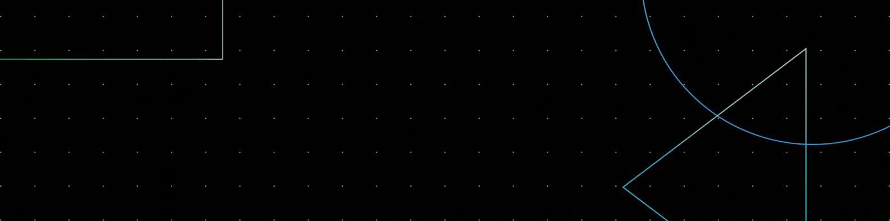

<!-- Divider -->

<!-- Banner Image -->

  

## <picture></picture> About Me

  At 22, I'm completing my fourth year of studying <strong>Systems Engineering</strong> and i'm excited to start my professional life. My goal is to immerse myself in dynamic projects and make valuable contributions to the tech community. I am dedicated to continuous learning and professional growth, seeking opportunities that align with my passion for advancing technology and making a meaningful impact in the field.

<!-- Section Title -->

  <ul align="center">
    
<h2 style="display: inline-block">Technologies That I Know 👨🏻‍💻</h2>

  </ul>

<!-- Tech Stack Icons -->

  

<!-- Intro -->
  
- :student: I am studying Systems Engineering at [UNICEN](https://www.unicen.edu.ar).
- :technologist: I love use software as a solution for every `problem`.
- :nerd_face: Always `learning new things`.
- :thinking: I'm currently open for a new `job opportunity`.
- 📫 Feel free to reach out to me at **eliseovilla10@gmail.com**.

<!-- LinkedIn Badge -->

<!-- Profile Views -->

## <b> GitHub Stats </b>
 

  

<!-- Divider -->
 

