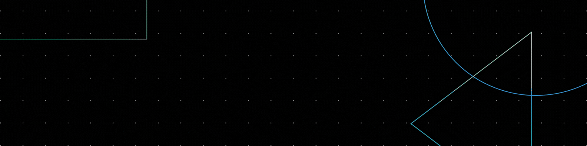

<!-- Divider -->

<!-- Banner Image -->

  

## <picture></picture> About Me

  I am a <strong>Software Engineer</strong>, 24 years old, focused on <strong>backend development</strong>, <strong>cloud infrastructure</strong>, and <strong>DevOps practices</strong>. I enjoy designing reliable services, automating delivery pipelines, and building scalable systems with a strong emphasis on maintainability, observability, and operational excellence.

<!-- Section Title -->

  <ul align="center">
    
<h2 style="display: inline-block">Backend, Cloud & DevOps Stack 👨🏻‍💻</h2>

  </ul>

<!-- Tech Stack Icons -->

  

<!-- Intro -->
  
- :mortar_board: Systems Engineer with a software engineering mindset and a strong interest in high-impact platforms.
- :technologist: I build backend services and cloud-based systems for real-world `problems`.
- :gear: Interested in automation, CI/CD, infrastructure as code, containerized workloads, and reliable delivery processes.
- :nerd_face: Always `learning new things`.
- :cloud: Focused on backend development, cloud infrastructure, DevOps, and scalable production environments.
- :thinking: Open to backend, cloud, and DevOps engineering `opportunities`.
- 📫 Feel free to reach out to me at **eliseovilla10@gmail.com**.

<!-- LinkedIn Badge -->

<!-- Profile Views -->

## <b> GitHub Stats </b>
 

  

<!-- Divider -->
 

